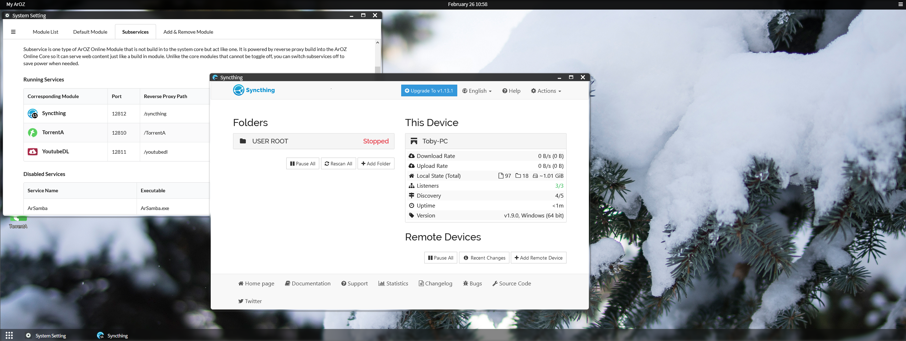
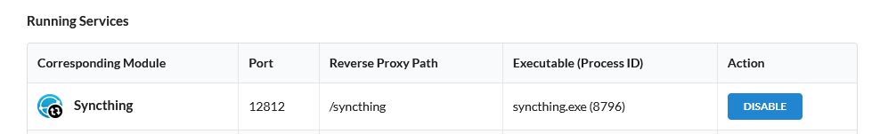

# syncthing
Syncthing subservice config demo for ArozOS



### Installation

1. Clone this repo into your subservice directory (usually can be found under ~/arozos/subservice)

   ```
   cd ~/arozos/subservice
   git clone https://github.com/aroz-online/syncthing
   cd syncthing
   ```

2. Download the desired syncthing binary from their release page
   https://github.com/syncthing/syncthing

3. Unzip the binary into the syncthing subservice root folder

   ```
   tar -xvf <downloaded tarball name here>
   ```

4. Change ```moduleInfo.json``` based on the downloaded binary version

   ```
   sudo nano moduleInfo.json
   # Change the line "Version":"1.5.0-rc.2", to your downloaded version of syncthing
   ```

5. Assign correct permissions to the subservices folder and binary

   ```
   sudo chmod -R 755 ./
   ```

6. Restart your arozos service

   ```
   sudo systemctl restart arozos
   ```

### Binary Filename
The filename of the binary files must match the following pattern
```
<parent folder name>_<runtime.GOOS>_<runtime.GOARCH>

e.g. (syncthing module)
//Other platforms
syncthing_darwin_amd64
syncthing_linux_amd64
syncthing_linux_arm
syncthing_linux_arm64

//Windows only
syncthing.exe
```

## Enable Subservice

If your Syncthing subservice isn't started by default, check if it has been disabled in the System Setting --> Subservice --> Disabled Services and click "Start" to start the subservice. If the subservice is unable to start, check the terminal of ArozOS output to see if there are any errors.

```
sudo systemctl status arozos
```

If success you will see something like this



In most case, it will be permission settings issue or you have downloaded an invalid binary file (or Windows defender is doing something if you are on Windows).


## Important Notes

- This module is not officially supported and only exists here as a reference for startscript type module bindings.  (See .startscript,. moduleInfo.json and start.sh)
- Syncthings do not implement ArozOS user isolation system. Hence, this module might break ArozOS user isolation policy under multi-user systems.
- Syncthing also do not use ArozOS virtual file system layer and all path used in the UI (powered by reverse proxy) will be directly interacting with the base file systems. ArozOS and its developer will not bare any responsibility for any data loss or user escaping the ArozOS virtual file system sandbox.


## License

MPLv2
